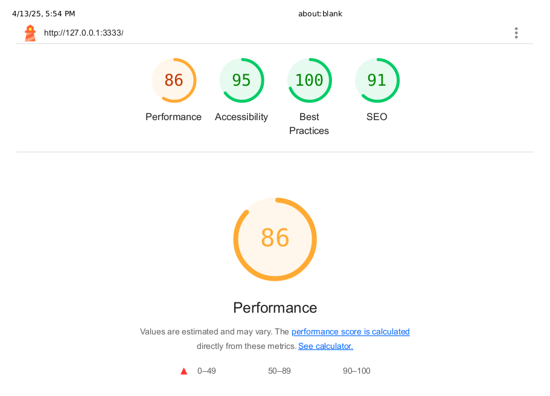
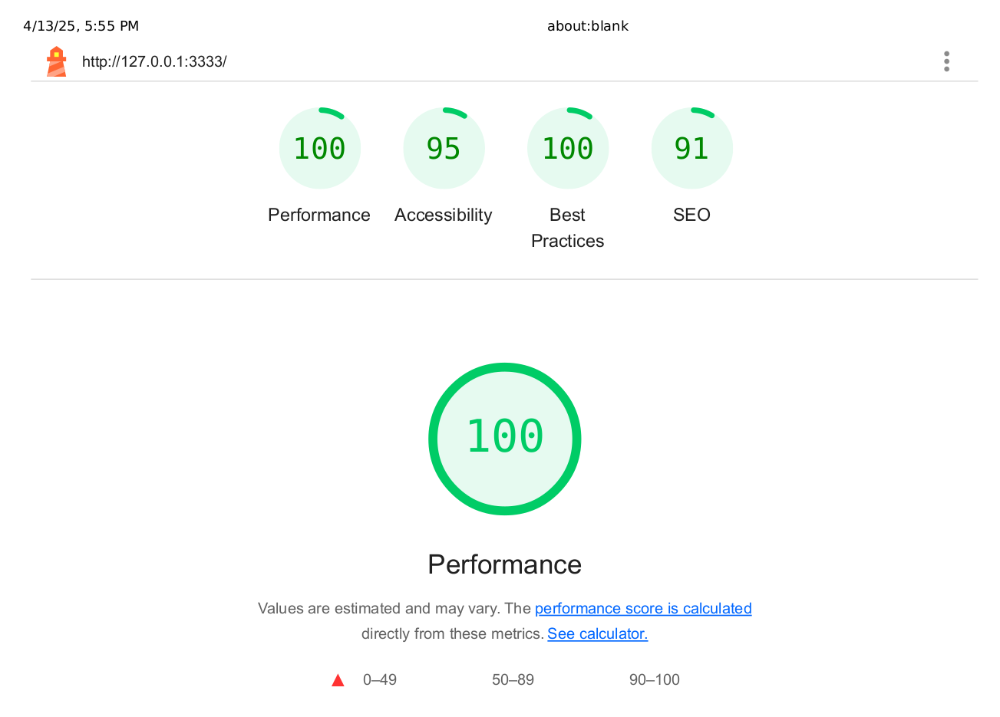
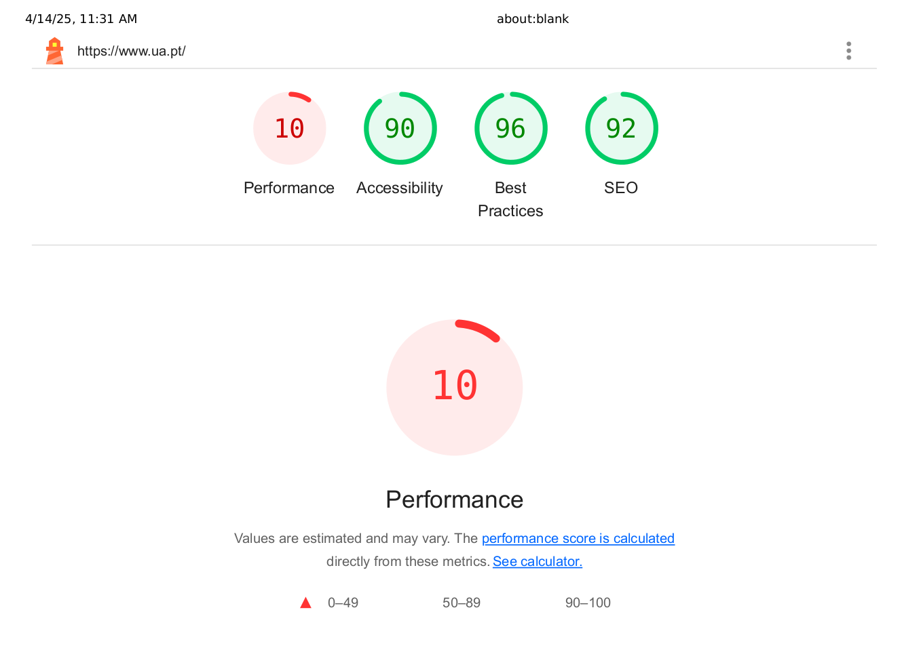

# Guião 7

## 7.1

### f)

Os seguintes checks falharam durante o teste com alta carga:

**Check de taxa dos checks:**
- _Threshold_: rate>0.98 (98% ou mais dos checks deveriam passar)
- _Resultado_: taxa de 68.35% (muito abaixo do limite de 98%)

**Check de duração das requisições HTTP:**
- _Threshold_: p(95)<1100 (95% das requisições deveriam ser mais rápidas que 1100ms/1,1s)
- _Resultado_: p(95)=1.99s (quase o dobro do limite aceitável)

**Check de taxa de falhas HTTP:**
- _Threshold_: rate<0.01 (menos de 1% das requisições deveriam falhar)
- _Resultado_: taxa de 63.28% (uma taxa de falha extremamente alta)

Também podemos observar detalhes específicos das falhas:

1. 31.64% dos checks falharam (3579 de 11310)
2. O check "is status 200" passou apenas em 36% dos casos
3. O tempo médio de resposta foi de 1.29 segundos
4. 63.28% das requisições HTTP falharam (3579 de 5655)

Isso demonstra claramente que o sistema não está dimensionado para lidar com 120 utilizadores virtuais simultâneos. Quando submetido a essa carga elevada, o sistema começa a responder muito mais lentamente (quase 2 segundos para o percentil 95), começa a falhar em muitas requisições (mais de 63%) e não consegue manter a qualidade de serviço definida nos SLOs (Service Level Objectives)

### g)

Três checks falharam no último teste:

1. O check 'checks' falhou com uma taxa de 68.35% (abaixo do threshold >98%)
2. O check 'http_req_duration' falhou com p(95)=1.99s (acima do threshold <1100ms)
3. O check 'http_req_failed' falhou com uma taxa de 63.28% (acima do threshold <0.01 ou 1%)

O check que teve o pior desempenho foi 'http_req_failed', que atingiu uma taxa de falha de 63.28%, muito acima do limite aceitável de 1%.

## 7.3

### c)

**Principais métricas de performance:**

- Largest Contentful Paint (3.3s): Momento em que o maior elemento visível (texto ou imagem) é renderizado
- First Contentful Paint (2.8s): Tempo até o primeiro conteúdo significativo aparecer
- Speed Index (2.8s): Velocidade com que o conteúdo é visualmente preenchido
- Total Blocking Time (80ms): Tempo em que a interatividade é bloqueada
- Cumulative Layout Shift (0): Medida de estabilidade visual durante o carregamento (excelente)

**Oportunidades de melhoria de performance:**

- Habilitar compressão de texto (economia de 197 KiB)
- Reduzir JavaScript não utilizado (economia de 142 KiB)
- Redimensionar imagens adequadamente
- Eliminar recursos que bloqueiam a renderização

**Como melhorar a acessibilidade:**

- Melhorar o contraste entre cores de fundo e texto
- Garantir navegabilidade por teclado
- Assegurar ordem lógica de tabulação
- Usar elementos de landmark HTML5 para melhor navegação
- Adicionar rótulos apropriados para controlos personalizados

### d)

Comparando os resultados do Lighthouse via CLI e via Chrome DevTools (aba anónima), podemos observar algumas pequenas diferenças:

**Pontuação geral:**
- _CLI_: Performance 87, Acessibilidade 95, Melhores Práticas 100, SEO 91
- _Chrome DevTools_: Performance 86, Acessibilidade 95, Melhores Práticas 100, SEO 91

**Métricas principais:**

1. **First Contentful Paint (FCP):**
   - _CLI_: 2.8s
   - _Chrome DevTools_: 2.9s

2. **Largest Contentful Paint (LCP):**
    - _CLI_: 3.3s
    - _Chrome DevTools_: 3.4s

3. **Total Blocking Time (TBT):**
   - _CLI_: 80ms
   - _Chrome DevTools_: 120ms

4. **Speed Index:**
   - _CLI_: 2.8s
   - _Chrome DevTools_: 2.9s

5. **Cumulative Layout Shift (CLS):**
   - _Ambos_: 0 (excelente)

**Principais diferenças:**
- Performance global levemente inferior no Chrome DevTools (86 vs 87)
- Total Blocking Time significativamente maior no Chrome DevTools (120ms vs 80ms)
- Tarefas longas na thread principal: 3 tarefas no Chrome DevTools vs 2 tarefas no CLI
- Tempo de execução JavaScript: 0.3s no Chrome DevTools vs 0.2s no CLI
- Trabalho na thread principal: 0.7s no Chrome DevTools vs 0.5s no CLI

### e)

Os resultados do Lighthouse para desktop são substancialmente melhores que os obtidos para mobile. A pontuação de Performance aumentou de 86 para 100 pontos, refletindo melhorias significativas em todas as métricas principais:
O FCP reduziu de 2.9s para 0.6s, o LCP de 3.4s para 0.7s, e o TBT de 120ms para 0ms. O tempo de execução JavaScript e o trabalho na thread principal também diminuíram drasticamente.
Estas diferenças ocorrem principalmente porque:

- O teste desktop emula hardware mais potente
- As condições de rede são menos restritivas para desktop ("Custom throttling" vs "Slow 4G")
- Muitos sites ainda são otimizados prioritariamente para desktop
- Dispositivos móveis têm recursos de processamento mais limitados

### f) 

- **Performance:** Afeta diretamente a experiência do utilizador e as taxas de abandono. Sites lentos podem perder utilizadores e vendas. Estudos mostram que cada segundo adicional de carregamento pode reduzir conversões em 7-10%. A performance também afeta o posicionamento nos motores de busca.

- **Acessibilidade:** Garante que o site é utilizável por pessoas com deficiências, representando até 15% da população mundial. Além da questão ética e inclusiva, em muitos países há obrigações legais para conformidade com padrões de acessibilidade, evitando possíveis processos judiciais.

- **Boas práticas:** Contribuem para a segurança, manutenção e estabilidade a longo prazo. Sites que seguem boas práticas têm menor vulnerabilidade a ataques, são mais fáceis de atualizar e tendem a ter menos problemas em diferentes navegadores.

- **SEO:** Determina a visibilidade nos motores de busca, afetando diretamente o tráfego orgânico. Um site com problemas de SEO pode ter conteúdo excelente mas permanecer invisível para potenciais utilizadores.

### g)

Ao analisar o site da Universidade de Aveiro (https://www.ua.pt) com o Lighthouse, identifiquei problemas críticos, principalmente na área de performance que recebeu uma pontuação extremamente baixa de 10/100.
Principais problemas encontrados:

**Performance catastrófica (10/100) com métricas alarmantes:**
- Largest Contentful Paint de 29.3 segundos (recomendado: <2.5s)
- Total Blocking Time de 5,020 ms (mais de 5 segundos de bloqueio!)
- Speed Index de 12.7 segundos (recomendado: <4.3s)
- Cumulative Layout Shift de 0.319 (causando experiência instável)

**Problemas de carga e processamento:**
- Trabalho excessivo na thread principal (22.3 segundos)
- Tempo de execução JavaScript elevado (6.1 segundos)
- DOM extremamente grande (1,295 elementos)
- Payload de rede enorme (7,273 KiB = 7.1 MB)
- 20 tarefas longas bloqueando a interatividade

**Desperdício de recursos:**
- Compressão de texto não ativada (potencial economia de 2,485 KiB)
- CSS não utilizado (potencial economia de 366 KiB)
- JavaScript não utilizado (potencial economia de 1,580 KiB)
- Imagens mal dimensionadas (potencial economia de 707 KiB)

**Problemas de acessibilidade (90/100):**
- Elementos de diálogo sem nomes acessíveis
- Contraste insuficiente entre cores de fundo e texto
- Alvos de toque com tamanho ou espaçamento insuficientes

**Impactos:**
Um tempo de carregamento de quase 30 segundos para o conteúdo principal é absolutamente inaceitável para qualquer site moderno, especialmente para uma instituição educacional como uma universidade. Esta performance catastrófica tem múltiplas consequências: estudantes que utilizem dispositivos móveis ou com conexões mais lentas provavelmente abandonarão o site antes que este carregue completamente, desperdiçando oportunidades de comunicação; o consumo elevado de dados móveis (mais de 7 MB por carregamento) prejudica significativamente utilizadores com planos de dados limitados; a dificuldade de navegação cria barreiras significativas para pessoas com deficiências visuais ou motoras, comprometendo a acessibilidade; e, talvez mais preocupante do ponto de vista institucional, existe um potencial impacto negativo no recrutamento de novos estudantes, que frequentemente avaliam a qualidade e modernidade de uma universidade pela sua presença digital.

**Dificuldade de correção:**

Corrigir estes problemas num site institucional de longa data como o da UA apresenta desafios consideráveis:
- Estruturas de decisão hierárquicas podem tornar as mudanças lentas
- Sistemas legados e integrações com múltiplos subsistemas universitários
- Possível dependência de CMS antiquados ou personalizações extensivas
- Recursos técnicos limitados ou equipas sobrecarregadas
Prioridades concorrentes entre departamentos académicos

**Como estes problemas poderiam ser evitados:**
- Implementar uma estratégia de "performance budgets" para todas as páginas, estabelecendo limites claros para tamanhos de recursos
- Criar um pipeline de CI/CD que inclua testes automáticos de performance e acessibilidade
- Adotar uma arquitetura mais moderna, possivelmente baseada em micro-frontends
- Formar a equipa em práticas modernas de desenvolvimento web e conscientização sobre acessibilidade
- Implementar revisões periódicas de código e auditorias de performance
- Utilizar estratégias progressivas de carregamento e técnicas avançadas como code-splitting
- Desenvolver com uma abordagem "mobile-first" para garantir uma experiência aceitável em todos os dispositivos

O site da UA demonstra claramente por que os testes de performance e acessibilidade devem ser parte integrante do processo de desenvolvimento desde o início, e não apenas considerações posteriores. A situação atual provavelmente exigirá uma reformulação significativa, e não apenas pequenos ajustes incrementais, para alcançar níveis aceitáveis de desempenho e experiência do utilizador.

