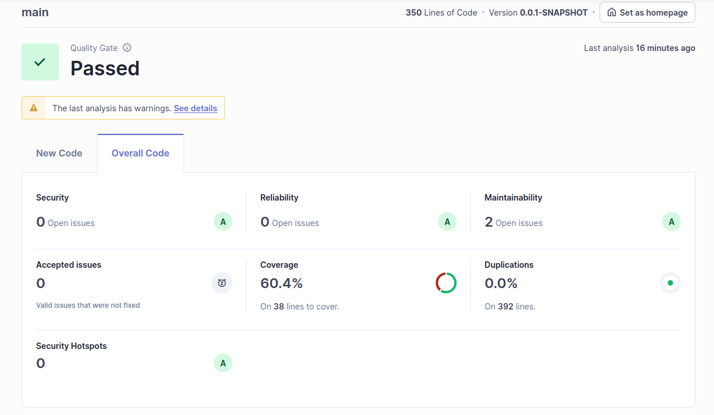
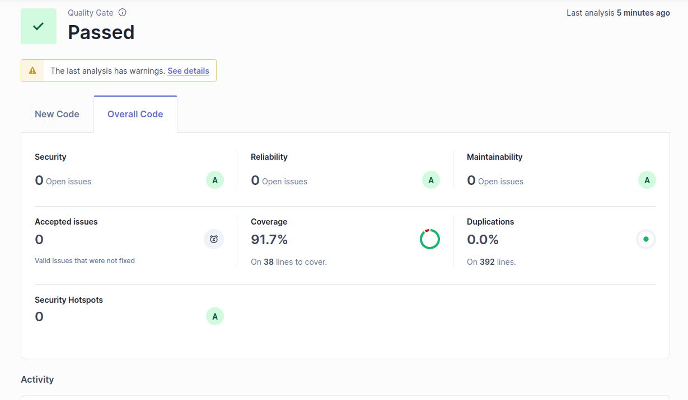
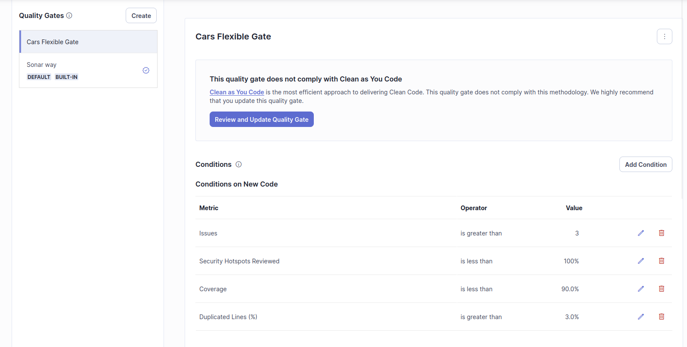

# Resolução do Guião

## 8.1

### f)

A análise do projeto foi executada com sucesso no SonarQube. Aqui estão os principais resultados:

**Métricas Principais**
- **Linhas de Código**: 327
- **Cobertura de Testes**: 78.7% (141 linhas para cobrir)
- **Duplicação de Código**: 0.0% (481 linhas analisadas)
- **Qualidade do Código**: Aprovada no Quality Gate
- **Versão**: 1.0-SNAPSHOT

**Avaliações de Qualidade**
- **Segurança**: Rating A (0 issues abertos)
- **Confiabilidade**: Rating A (0 issues abertos)
- **Manutenibilidade**: Rating A (33 issues abertos)
- **Security Hotspots**: 1 hotspot não revisado (Rating E)

**Detalhes da Análise**
- O projeto passou no Quality Gate definido
- Primeira análise realizada em 15 de Abril de 2025
- Não há issues aceitas (0 issues válidos não corrigidos)
- A análise tem alguns avisos que devem ser verificados

**Observações**
- A cobertura de testes está em 78.7%, o que é um bom valor, mas pode ser melhorado
- A manutenibilidade tem 33 issues abertos que podem ser melhorados
- Existe 1 security hotspot que precisa de revisão
- O código não apresenta duplicações, o que é um ponto positivo
- As avaliações de Segurança e Confiabilidade estão excelentes (Rating A)

**Acesso ao Dashboard**
O dashboard completo pode ser acessado em: http://127.0.0.1:9001/dashboard?id=eurom1 

### g)

| Issue | Problem description | How to solve |
|-------|-------------------|--------------|
| Security | Não foram encontrados problemas de segurança críticos (0 issues) | Não são necessárias ações imediatas |
| Reliability | Não foram encontrados problemas de confiabilidade (0 issues) | Não são necessárias ações imediatas |
| Maintainability | Foram encontrados 33 code smells, que são problemas relacionados com a manutenibilidade do código | - Refatorar código duplicado<br>- Simplificar métodos complexos<br>- Remover código morto<br>- Melhorar nomes de variáveis e métodos |
| Security hotspot | 1 security hotspot identificado que precisa de revisão | Revisar o código identificado para garantir que não há vulnerabilidades de segurança potenciais |

### h)

**Checkstyle:**
- É uma ferramenta de análise estática para Java
- Verifica se o código segue padrões de codificação específicos
- Ajuda a manter consistência no estilo de código
- Pode verificar formatação, convenções de nomenclatura, e boas práticas de codificação

**PMD:**
- Ferramenta de análise de código fonte
- Detecta possíveis bugs, código morto, código duplicado
- Identifica expressões complexas e otimizações possíveis
- Ajuda a encontrar práticas de programação problemáticas

**SpotBugs:**
- Analisa o bytecode Java para encontrar potenciais bugs
- Identifica problemas de performance
- Detecta más práticas de programação
- Encontra vulnerabilidades de segurança comuns

## 8.2



### c)

O SonarQube encontrou 2 problemas (code smells) que contribuem para a dívida técnica:

**Em `CarControllerTest.java`:**
- **Problema:** Importação desnecessária da classe JsonUtils
- **Razão:** Classes do mesmo pacote são sempre importadas implicitamente
- **Impacto:** Afeta a manutenibilidade do código
- **Esforço** estimado: 1 minuto para corrigir
- **Solução:** Remover a linha de importação desnecessária

**Em `CarRestControllerIT.java`:**
- **Problema:** Modificador public desnecessário no método resetDb()
- **Razão:** Em classes de teste JUnit, os métodos não precisam ser explicitamente declarados como públicos
- **Impacto:** Afeta a manutenibilidade do código
- **Solução:** Remover o modificador public

### d)

A cobertura geral do projeto é de 60.4%, o que é um valor moderado. Vamos analisar classe por classe:

**CarController.java e CarManagerService.java:**
- **Cobertura:** 100%
- **Linhas não cobertas:** 0
- **Condições não cobertas:** 0
- **Avaliação:** Excelente! Estas classes têm cobertura total, o que é ideal especialmente para classes de controlo e serviços.

**Car.java (Classe de modelo):**
- **Cobertura:** 43.3%
- **Linhas não cobertas:** 7
- **Condições não cobertas:** 10
- **Código não coberto:** métodos equals(), hashCode(), setCarId() e toString()
- **Avaliação:** Cobertura baixa, mas são maioritariamente métodos utilitários que são menos críticos.

**CarServiceApplication.java:**
- **Cobertura:** 33.3%
- **Linhas não cobertas:** 2
- **Condições não cobertas:** 33
- **Código não coberto:** método main()
- **Avaliação:** Cobertura baixa, mas é aceitável pois é apenas a classe principal de inicialização da aplicação Spring.

### e)




### f)

O projeto passou no Quality Gate usando a configuração padrão "Sonar Way", com todas as regras principais (Segurança, Confiabilidade, Manutenibilidade, Cobertura, Duplicações e Security Hotspots) a passar com classificação A. Não existem regras a falhar, tendo apenas alguns avisos relacionados com a configuração do Git que não afetam a qualidade do código.

### g)



Sugiro criar uma Quality Gate chamada "Cars Flexible Gate" com os seguintes critérios mais flexíveis:

**Coverage:**
- **Condição:** Coverage em novo código > 90% (em vez de 80%)
- **Justificação:** Ainda mantém um bom nível de cobertura mas dá mais flexibilidade aos desenvolvedores

**Issues:**
- **Condição:** Issues < 3 (em vez de 0)
- **Justificação:** É uma flexibilização deliberadamente não recomendada, conforme pedido no enunciado ("make the 'no issues' rule more flexible (not a best practice)"). Esta alteração permite que pequenos problemas passem no Quality Gate, mas é uma má prática pois pode levar à acumulação de dívida técnica e potenciais problemas de qualidade no código ao longo do tempo.

## 8.3

#### 1. Duplicação de String Literal
**Ficheiro**: `projHomeMaid/backend/src/main/java/pt/ua/deti/ies/backend/controller/UserController.java`

**Problema**: A string literal "error" está duplicada 5 vezes no código

**Impacto**: 
- Reduz a manutenibilidade do código
- Aumenta o risco de inconsistências ao alterar mensagens de erro
- Viola o princípio DRY (Don't Repeat Yourself)

**Exemplo**:
```java
return ResponseEntity.status(HttpStatus.BAD_REQUEST)
    .body(Map.of("error", "ProFicheiro picture is required."));
```

**Solução**:
- Definir uma constante para a string "error"
- Utilizar a constante por todo o código
- Exemplo de correção:
```java
private static final String ERROR_KEY = "error";

// Mais tarde no código
return ResponseEntity.status(HttpStatus.BAD_REQUEST)
    .body(Map.of(ERROR_KEY, "ProFicheiro picture is required."));
```

**Aprendizagem**: Este problema destaca a importância de:
- Utilizar constantes para strings literais repetidas
- Seguir os princípios DRY
- Tornar o código mais manutenível e menos propenso a erros


#### 2. Ausência de Caso Padrão em Instrução Switch
**Ficheiro**: `projHomeMaid/backend/src/main/java/pt/ua/deti/ies/backend/service/HouseService.java`

**Problema**: Instrução switch sem caso padrão e strings literais duplicadas

**Impacto**: 
- Potenciais erros de execução para casos não tratados
- Mais difícil de manter devido à duplicação de strings literais
- Viola princípios de programação defensiva

**Exemplo**:
```java
switch (roomType) {
    case "hall":
        Device hallHeatedFloor = new Device("heatedFloor_" + roomType + "_" + houseId, "heatedFloor");
        hallHeatedFloor.setName("Hall Heated Floor");
        // ...
}
```

**Solução**:
- Adicionar um caso padrão para tratar tipos de sala inesperados
- Definir constantes para strings literais repetidas
- Exemplo de correção:
```java
private static final String HEATED_FLOOR = "heatedFloor";
private static final String HEATED_FLOOR_PREFIX = "heatedFloor_";
private static final String HALL_HEATED_FLOOR = "Hall Heated Floor";

switch (roomType) {
    case "hall":
        Device hallHeatedFloor = new Device(HEATED_FLOOR_PREFIX + roomType + "_" + houseId, HEATED_FLOOR);
        hallHeatedFloor.setName(HALL_HEATED_FLOOR);
        // ...
    default:
        throw new IllegalArgumentException("Unknown room type: " + roomType);
}
```

**Aprendizagem**: Este problema ensina:
- A importância de tratar todos os casos possíveis em instruções switch
- Os benefícios de utilizar constantes para strings literais
- Práticas de programação defensiva

#### 3. Funções Profundamente Aninhadas
**Ficheiro**: `projHomeMaid/frontend/src/components/automationsPages/AirConditionerPage/AirCondAutomation.jsx`

**Problema**: Funções aninhadas com mais de 4 níveis de profundidade

**Impacto**: 
- Legibilidade do código reduzida
- Mais difícil de testar e manter
- Aumento da complexidade cognitiva

**Exemplo**:
```javascript
useEffect(() => {
    const token = localStorage.getItem("jwtToken");
    if (!token) {
        navigate("/login");
        return;
    }
    client.onConnect = () => {
        client.subscribe(`/topic/device-updates`, (message) => {
            const updatedData = JSON.parse(message.body);
            if (updatedData.deviceId === deviceId && 
                updatedData.executionTime && 
                updatedData.changes && 
                (updatedData.changes.state === true || updatedData.changes.state === false)) {
                setAutomatizations((prev) => [...prev, updatedData]);
            }
        });
    };
});
```

**Solução**:
- Extrair funções aninhadas para funções separadas e bem nomeadas
- Utilizar retornos antecipados para reduzir aninhamento
- Exemplo de correção:
```javascript
const handleDeviceUpdate = (message) => {
    const updatedData = JSON.parse(message.body);
    if (!isValidDeviceUpdate(updatedData)) return;
    setAutomatizations((prev) => [...prev, updatedData]);
};

const isValidDeviceUpdate = (data) => {
    return data.deviceId === deviceId && 
           data.executionTime && 
           data.changes && 
           (data.changes.state === true || data.changes.state === false);
};

useEffect(() => {
    const token = localStorage.getItem("jwtToken");
    if (!token) {
        navigate("/login");
        return;
    }
    
    client.onConnect = () => {
        client.subscribe(`/topic/device-updates`, handleDeviceUpdate);
    };
});
```

**Aprendizagem**: Este problema demonstra:
- A importância de manter funções superficiais e focadas
- Os benefícios da extração de funções para legibilidade
- Como reduzir a complexidade cognitiva no código

## 8.4

### `UserController.java` Analysis

#### Prompts Utilizados
1. "Analise o código do UserController.java e identifique problemas de clean code e manutenibilidade"
2. "Sugira refatorações para melhorar a qualidade do código do UserController.java"
3. "Identifique padrões de código que podem ser melhorados usando técnicas de refatoração conhecidas"

#### Feedback sobre Qualidade do Código

##### Pontos Positivos
- Uso adequado de injeção de dependência
- Documentação com Swagger
- Tratamento básico de exceções
- Separação de responsabilidades entre controller e services

##### Problemas Identificados

1. **Duplicação de Código**
   - Strings literais repetidas ("error", "Internal server error")
   - Padrões similares de tratamento de exceções em vários métodos

2. **Inconsistência no Tratamento de Erros**
   - Alguns métodos retornam mensagens de erro como strings, outros como Map
   - Códigos HTTP hardcoded (500 em vez de HttpStatus.INTERNAL_SERVER_ERROR)

3. **Falta de Validação de Input**
   - Parâmetros não são validados antes do uso
   - Ausência de validação de formato de email e senha

4. **Logging Insuficiente**
   - Uso de System.out.println para logging
   - Falta de logs estruturados para debugging

5. **Inconsistência no Retorno de Respostas**
   - Mistura de tipos de retorno (String, Map, ResponseEntity)
   - Falta de padronização nas mensagens de erro

#### Sugestões de Refatoração

1. **Replace Magic Numbers with Named Constants**
```java
// Antes
return ResponseEntity.status(500).body("Internal server error.");

// Depois
private static final String INTERNAL_SERVER_ERROR_MSG = "Internal server error.";
return ResponseEntity.status(HttpStatus.INTERNAL_SERVER_ERROR)
    .body(INTERNAL_SERVER_ERROR_MSG);
```

2. **Extract Method**
```java
// Extrair tratamento de exceções comum
private ResponseEntity<?> handleException(Exception e) {
    if (e instanceof IllegalArgumentException) {
        return ResponseEntity.badRequest().body(Map.of("error", e.getMessage()));
    }
    return ResponseEntity.status(HttpStatus.INTERNAL_SERVER_ERROR)
        .body(Map.of("error", INTERNAL_SERVER_ERROR_MSG));
}
```

3. **Introduce Parameter Object**
```java
// Criar DTO para parâmetros de signup
public class SignUpRequest {
    private String houseId;
    private String name;
    private String email;
    private String password;
    private MultipartFile profilePicture;
    // getters e setters
}
```

4. **Replace Error Code with Exception**
```java
// Criar exceções customizadas
public class UserNotFoundException extends RuntimeException {
    public UserNotFoundException(String message) {
        super(message);
    }
}
```

5. **Introduce Assertion**
```java
private void validateSignUpParameters(SignUpRequest request) {
    Objects.requireNonNull(request.getEmail(), "Email cannot be null");
    Objects.requireNonNull(request.getPassword(), "Password cannot be null");
    // outras validações
}
```

#### Recomendações para Produção

1. **Implementar Validação de Input**
   - Usar Bean Validation (@Valid)
   - Criar constraints customizadas para email e senha

2. **Padronizar Respostas de Erro**
   - Criar uma classe ErrorResponse
   - Implementar um ExceptionHandler global

3. **Melhorar Logging**
   - Implementar SLF4J/Logback
   - Adicionar logs estruturados

4. **Adicionar Documentação**
   - Melhorar documentação Swagger
   - Adicionar JavaDoc nos métodos

5. **Implementar Testes**
   - Unit tests para cada método
   - Integration tests para os endpoints

#### Conclusão
O código tem uma estrutura básica boa, mas precisa de melhorias significativas em termos de:
- Consistência
- Tratamento de erros
- Validação
- Documentação
- Testes

As refatorações sugeridas seguem princípios SOLID e boas práticas de clean code, tornando o código mais:
- Manutenível
- Testável
- Robusto
- Consistente

Recomendo implementar estas mudanças em ordem de prioridade:
1. Padronização de respostas de erro
2. Validação de input
3. Melhorias no logging
4. Refatorações de clean code
5. Implementação de testes

### `AutomationController.java` Analysis

#### Prompts Utilizados
1. "Analise o código do AutomationController.java e identifique problemas de clean code e manutenibilidade"
2. "Sugira refatorações para melhorar a qualidade do código do AutomationController.java"
3. "Identifique padrões de código que podem ser melhorados usando técnicas de refatoração conhecidas"

#### Feedback sobre Qualidade do Código

##### Pontos Positivos
- Uso adequado de injeção de dependência
- Separação clara de responsabilidades entre controller e service
- Endpoints RESTful bem definidos
- Configuração adequada de CORS
- Uso de ResponseEntity para respostas HTTP padronizadas

##### Problemas Identificados

1. **Falta de Validação de Input**
   - Ausência de validação do objeto Automation recebido no POST
   - Falta de validação do formato do executionTime no DELETE
   - Ausência de validação do deviceId

2. **Falta de Tratamento de Erros**
   - Ausência de tratamento de exceções específicas
   - Não há mensagens de erro personalizadas
   - Falta de logging adequado

3. **Falta de Documentação**
   - Ausência de anotações Swagger/OpenAPI
   - Falta de JavaDoc nos métodos
   - Documentação insuficiente dos endpoints

4. **Inconsistência no Retorno de Respostas**
   - DELETE retorna 204 (noContent) sem mensagem
   - Falta de padronização nas respostas de erro

5. **Falta de Segurança**
   - Ausência de validação de autenticação/autorização
   - Falta de rate limiting
   - Ausência de validação de permissões do usuário

#### Sugestões de Refatoração

1. **Adicionar Validação de Input**
```java
@PostMapping
public ResponseEntity<?> createAutomation(@Valid @RequestBody Automation automation) {
    try {
        validateAutomation(automation);
        return ResponseEntity.ok(automationService.createOrUpdateAutomation(
            automation.getDeviceId(),
            automation.getExecutionTime(),
            automation.getChanges()
        ));
    } catch (ValidationException e) {
        return ResponseEntity.badRequest().body(Map.of("error", e.getMessage()));
    }
}

private void validateAutomation(Automation automation) {
    if (automation.getDeviceId() == null || automation.getDeviceId().isEmpty()) {
        throw new ValidationException("Device ID is required");
    }
    if (automation.getExecutionTime() == null) {
        throw new ValidationException("Execution time is required");
    }
    if (automation.getChanges() == null || automation.getChanges().isEmpty()) {
        throw new ValidationException("Changes are required");
    }
}
```

2. **Implementar Tratamento de Erros Global**
```java
@ControllerAdvice
public class GlobalExceptionHandler {
    @ExceptionHandler(ValidationException.class)
    public ResponseEntity<?> handleValidationException(ValidationException e) {
        return ResponseEntity.badRequest().body(Map.of("error", e.getMessage()));
    }
    
    @ExceptionHandler(DeviceNotFoundException.class)
    public ResponseEntity<?> handleDeviceNotFoundException(DeviceNotFoundException e) {
        return ResponseEntity.status(HttpStatus.NOT_FOUND)
            .body(Map.of("error", e.getMessage()));
    }
}
```

3. **Adicionar Documentação Swagger**
```java
@Operation(summary = "Create a new automation")
@ApiResponses(value = {
    @ApiResponse(responseCode = "200", description = "Automation created successfully"),
    @ApiResponse(responseCode = "400", description = "Invalid input"),
    @ApiResponse(responseCode = "500", description = "Internal server error")
})
@PostMapping
public ResponseEntity<Automation> createAutomation(@RequestBody Automation automation) {
    // ...
}
```

4. **Implementar Segurança**
```java
@PreAuthorize("hasRole('USER')")
@PostMapping
public ResponseEntity<Automation> createAutomation(@RequestBody Automation automation) {
    // ...
}

@PreAuthorize("hasRole('USER')")
@DeleteMapping("/{deviceId}/{executionTime}")
public ResponseEntity<Void> deleteAutomation(@PathVariable String deviceId, 
                                           @PathVariable String executionTime) {
    // ...
}
```

5. **Adicionar Logging**
```java
@Slf4j
@RestController
@RequestMapping("/api/automations")
public class AutomationController {
    @PostMapping
    public ResponseEntity<Automation> createAutomation(@RequestBody Automation automation) {
        log.info("Creating automation for device: {}", automation.getDeviceId());
        try {
            // ...
        } catch (Exception e) {
            log.error("Error creating automation: {}", e.getMessage(), e);
            throw e;
        }
    }
}
```

#### Recomendações para Produção

1. **Implementar Validação Completa**
   - Adicionar validação de formato de deviceId
   - Validar limites de executionTime
   - Implementar validação de changes

2. **Melhorar Segurança**
   - Implementar autenticação JWT
   - Adicionar autorização baseada em roles
   - Implementar rate limiting

3. **Adicionar Testes**
   - Unit tests para cada método
   - Integration tests para os endpoints
   - Testes de validação

4. **Melhorar Documentação**
   - Adicionar documentação Swagger completa
   - Documentar todos os endpoints
   - Adicionar exemplos de uso

5. **Implementar Monitoramento**
   - Adicionar métricas de uso
   - Implementar health checks
   - Adicionar alertas para erros

#### Conclusão
O código tem uma estrutura básica boa, mas precisa de melhorias significativas em termos de:
- Validação de input
- Tratamento de erros
- Segurança
- Documentação
- Testes

As refatorações sugeridas seguem princípios SOLID e boas práticas de clean code, tornando o código mais:
- Seguro
- Robusto
- Manutenível
- Documentado
- Testável

Recomendo implementar estas mudanças em ordem de prioridade:
1. Validação de input e tratamento de erros
2. Implementação de segurança
3. Melhorias na documentação
4. Adição de testes
5. Implementação de monitoramento

### `HouseService.java` Analysis

#### Prompts Utilizados
1. "Analise o código do HouseService.java e identifique problemas de clean code e manutenibilidade"
2. "Sugira refatorações para melhorar a qualidade do código do HouseService.java"
3. "Identifique padrões de código que podem ser melhorados usando técnicas de refatoração conhecidas"

#### Feedback sobre Qualidade do Código

##### Pontos Positivos
- Uso adequado de injeção de dependência
- Separação clara de responsabilidades entre serviços
- Métodos bem nomeados e com propósito único
- Uso de Optional para tratamento de valores nulos
- Implementação de validação de acesso do usuário

##### Problemas Identificados

1. **Duplicação de Código**
   - Código repetido na criação de dispositivos similares
   - Padrões similares de configuração de dispositivos
   - Strings literais duplicadas para nomes de dispositivos

2. **Método Muito Longo**
   - `createDevicesForRoom` tem mais de 300 linhas
   - Switch case muito extenso
   - Alta complexidade ciclomática

3. **Falta de Encapsulamento**
   - Configurações hardcoded de dispositivos
   - Valores padrão espalhados pelo código
   - Falta de constantes para configurações

4. **Falta de Flexibilidade**
   - Configurações de dispositivos não são parametrizáveis
   - Dificuldade em adicionar novos tipos de dispositivos
   - Dificuldade em modificar configurações existentes

5. **Falta de Tratamento de Erros**
   - Ausência de exceções customizadas
   - Mensagens de erro genéricas
   - Falta de logging adequado

#### Sugestões de Refatoração

1. **Extrair Configurações para Classes Dedicadas**
```java
public class DeviceConfiguration {
    private final String type;
    private final String name;
    private final Map<String, Object> defaultSettings;

    public DeviceConfiguration(String type, String name, Map<String, Object> defaultSettings) {
        this.type = type;
        this.name = name;
        this.defaultSettings = defaultSettings;
    }

    public Device createDevice(String roomType, String houseId) {
        String deviceId = type + "_" + roomType + "_" + houseId;
        Device device = new Device(deviceId, type);
        device.setName(name);
        defaultSettings.forEach((key, value) -> {
            switch (key) {
                case "temperature" -> device.setTemperature((Double) value);
                case "brightness" -> device.setBrightness((Integer) value);
                // ... outros setters
            }
        });
        return device;
    }
}
```

2. **Implementar Factory Pattern para Criação de Dispositivos**
```java
public interface DeviceFactory {
    Device createDevice(String roomType, String houseId);
}

@Component
public class LampFactory implements DeviceFactory {
    private static final Map<String, DeviceConfiguration> LAMP_CONFIGS = Map.of(
        "ceiling", new DeviceConfiguration("lamp", "Ceiling Lamp", Map.of(
            "brightness", 1,
            "color", "#FFFFFF"
        )),
        "reading", new DeviceConfiguration("lamp", "Reading Lamp", Map.of(
            "brightness", 1,
            "color", "#FFFFFF"
        ))
    );

    @Override
    public Device createDevice(String roomType, String houseId) {
        return LAMP_CONFIGS.get(roomType).createDevice(roomType, houseId);
    }
}
```

3. **Extrair Constantes e Configurações**
```java
public class RoomConfig {
    public static final List<String> ROOM_TYPES = List.of(
        "hall", "masterBedroom", "guestBedroom", "kitchen",
        "livingRoom", "bathroom", "office", "laundry"
    );

    public static final Map<String, List<String>> ROOM_DEVICES = Map.of(
        "hall", List.of("heatedFloor", "clock", "lamp", "shutter"),
        "masterBedroom", List.of("shutter", "heatedFloor", "television", "lamp", "clock", "airConditioner"),
        // ... outras configurações
    );
}
```

4. **Implementar Builder Pattern para Dispositivos**
```java
public class DeviceBuilder {
    private String deviceId;
    private String type;
    private String name;
    private Double temperature;
    private Integer brightness;
    // ... outros atributos

    public DeviceBuilder(String deviceId, String type) {
        this.deviceId = deviceId;
        this.type = type;
    }

    public DeviceBuilder withName(String name) {
        this.name = name;
        return this;
    }

    public DeviceBuilder withTemperature(Double temperature) {
        this.temperature = temperature;
        return this;
    }

    public Device build() {
        Device device = new Device(deviceId, type);
        device.setName(name);
        device.setTemperature(temperature);
        // ... outros setters
        return device;
    }
}
```

5. **Adicionar Logging e Tratamento de Erros**
```java
@Slf4j
@Service
public class HouseService {
    public House createHouseWithRoomsAndDevices(String houseId) {
        log.info("Creating house with ID: {}", houseId);
        try {
            // ... código existente
        } catch (Exception e) {
            log.error("Error creating house: {}", e.getMessage(), e);
            throw new HouseCreationException("Failed to create house: " + e.getMessage());
        }
    }
}
```

#### Recomendações para Produção

1. **Implementar Configuração Externa**
   - Mover configurações para arquivos properties/yaml
   - Permitir override de configurações por ambiente
   - Implementar validação de configurações

2. **Melhorar Tratamento de Erros**
   - Criar hierarquia de exceções customizadas
   - Implementar retry mechanism para operações críticas
   - Adicionar circuit breaker para operações externas

3. **Adicionar Testes**
   - Unit tests para cada factory
   - Integration tests para criação de casas
   - Testes de configuração

4. **Melhorar Performance**
   - Implementar cache para configurações
   - Otimizar criação em lote de dispositivos
   - Usar paralelismo onde apropriado

5. **Implementar Monitoramento**
   - Adicionar métricas de criação de dispositivos
   - Monitorar uso de recursos
   - Implementar alertas para erros

#### Conclusão
O código tem uma estrutura básica boa, mas precisa de melhorias significativas em termos de:
- Organização do código
- Flexibilidade
- Manutenibilidade
- Tratamento de erros
- Performance

As refatorações sugeridas seguem princípios SOLID e boas práticas de clean code, tornando o código mais:
- Flexível
- Manutenível
- Testável
- Robusto
- Escalável

Recomendo implementar estas mudanças em ordem de prioridade:
1. Extrair configurações e implementar factories
2. Melhorar tratamento de erros e logging
3. Adicionar testes
4. Implementar monitoramento
5. Otimizar performance

### e)

Depois de trabalhar tanto com o SonarQube quanto com ferramentas de IA para revisão de código, notei algumas grandes diferenças entre as duas.
O SonarQube é muito bom para encontrar problemas específicos de forma consistente. Ele segue regras claras e consegue identificar code smells, bugs e vulnerabilidades de segurança de forma sistemática. É útil porque mostra métricas objetivas, o que ajuda a acompanhar o progresso do projeto ao longo do tempo.

Já a IA trouxe uma experiência diferente. Em vez de só apontar erros, ela conseguiu me dar uma visão mais ampla do código.
- Analisou o contexto geral, não apenas problemas isolados
- Sugeriu soluções mais completas, com exemplos concretos
- Recomendou padrões de design (Factory, Builder) que o SonarQube nem menciona
- Ajudou-me a entender conceitos mais avançados de programação

Senti que a IA funcionou mais como um mentor, enquanto o SonarQube é mais como um verificador de regras. Por isso, acho que o ideal é usar os dois juntos: o SonarQube para a base sólida de identificação de problemas e métricas, e a IA para entender melhor o design e a arquitetura do código.
No final, a experiência com a IA foi mais educativa para mim como programador, mas o SonarQube continua essencial para garantir que o código cumpra padrões básicos de qualidade.